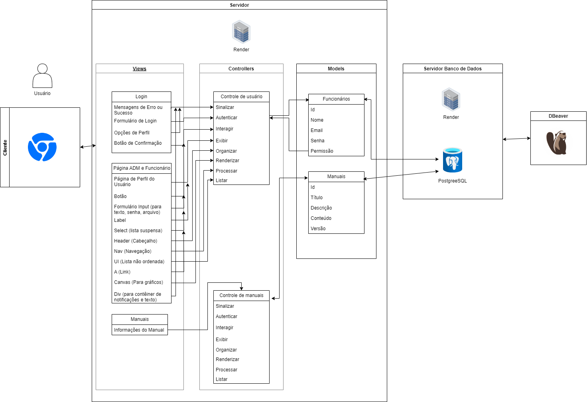

# Ponderada_2
 Atividade da semana 2, ponderada de programação, realizada pela aluna Iasmim Santos.

# Design de Arquitetura MVC

# Readme para Arquitetura MVC em Markdown
- Nome do Projeto: Design de Arquitetura MVC para Dell Technologies
- Descrição: Na arquitetura MVC delineada neste documento, foram detalhadas as dinâmicas e interações entre os usuários e o banco de dados para a solução proposta pela Dell Technologies, que abrange uma Aplicação Web voltada para o Treinamento Técnico de Funcionários por meio de manuais. Esta estrutura oferece uma compreensão abrangente do funcionamento do sistema, delineando como os usuários interagem com a plataforma e como os dados são gerenciados para fornecer uma experiência de aprendizado eficaz e intuitiva.
- Arquitetura: MVC (Model-View-Controller)
- Ferramenta de Diagramação: draw.io

### Modelos (Models):

**Entidade Funcionários:**
- Atributos:
  - id (identificador único do funcionário)
  - nome (nome do funcionário)
  - email (endereço de e-mail do funcionário)
  - senha (senha para autenticação do funcionário)
  - permissão (nível de permissão do funcionário na aplicação)

**Entidade Manuais:**
- Atributos:
  - id (identificador único do manual)
  - título (título do manual)
  - descrição (breve descrição do conteúdo do manual)
  - conteúdo (conteúdo do manual, que pode incluir texto, imagens, vídeos, etc.)
  - versão (número da versão do manual)

**Relações entre as entidades:**
- Um funcionário pode estar associado a vários manuais, e cada manual pode ser atribuído a muitos funcionários. Portanto, há uma relação de **muitos para muitos** entre Funcionários e Manuais.

### Controladores (Controllers):

**Controlador de Usuários:**
- Responsabilidades: Gerenciar as operações relacionadas aos funcionários da aplicação, como autenticação e interações com seus dados.
  
  - Ações (Methods):
    1. Sinalizar: Marca um manual como "visto" por um funcionário.
       - Parâmetros de entrada: ID do manual, ID do funcionário.
       - Saída: Confirmação da marcação do manual como "visto".
    2. Autenticar: Verifica as credenciais de um funcionário para login.
       - Parâmetros de entrada: Email e senha do funcionário.
       - Saída: Autorização de acesso à aplicação.
    3. Interagir: Gerencia interações de um funcionário com sua conta, como visualização de manuais
       - Parâmetros de entrada: Nenhum, pois a visualização de manuais não requer entrada adicional.
       - Saída: Dados do manual para exibição na interface do usuário.
    4. Exibir: Recupera os dados de um funcionário específico para exibição.
       - Parâmetros de entrada: ID do funcionário.
       - Saída: Dados do funcionário para exibição na interface.
    5. Organizar: Organiza os funcionários por critérios específicos, como ordem alfabética ou linhas da fábrica.
       - Parâmetros de entrada: Critério de organização.
       - Saída: Lista de funcionários organizada conforme o critério.
    6. Renderizar: Prepara os dados necessários para renderizar a interface relacionada aos funcionários.
       - Parâmetros de entrada: Dados dos funcionários sobre o andamento dos manuais.
       - Saída: Dados necessários para renderizar a interface.
    7. Processar: Gerencia as ações relacionadas aos funcionários, como adição, edição ou remoção.
       - Parâmetros de entrada: Dados do funcionário ou ID do funcionário, dependendo da ação.
       - Saída: Confirmação da operação realizada.
    8. Listar: Recupera uma lista de funcionários cadastrados na aplicação.
       - Parâmetros de entrada: N/A.
       - Saída: Lista de funcionários para exibição na interface.

**Controlador de Manuais:**
- Responsabilidades: Gerenciar as operações relacionadas aos manuais da aplicação, como exibição, marcação de progresso e organização.
  
  - Ações (Methods):
    1. Exibir: Recupera os dados de um manual específico para exibição.
       - Parâmetros de entrada: ID do manual.
       - Saída: Dados do manual para exibição na interface.
    2. Organizar: Organiza os manuais por critérios específicos, como ordem alfabética ou versão.
       - Parâmetros de entrada: Critério de organização.
       - Saída: Lista de manuais organizada conforme o critério.
    3. Renderizar: Prepara os dados necessários para renderizar a interface relacionada aos manuais.
       - Parâmetros de entrada: Manuais.
       - Saída: Dados necessários para renderizar a interface.
    4. Processar: Gerencia a marcação de progresso de um funcionário em um manual.
       - Parâmetros de entrada: ID do manual, ID do funcionário.
       - Saída: Confirmação da marcação do progresso.
    5. Listar: Lista de manuais disponíveis na aplicação.
       - Parâmetros de entrada: Manuais disponilizados pelos ADM.
       - Saída: Lista de manuais para exibição na interface.
    6. Sinalizar: Marca um manual como "visto" por um funcionário.
       - Parâmetros de entrada: ID do manual, ID do funcionário.
       - Saída: Confirmação da marcação do manual como "visto".
    7. Interagir: Gerencia as ações relacionadas aos manuais, como adição, edição ou remoção.
       - Parâmetros de entrada: Dados do manual ou ID do manual, dependendo da ação.
       - Saída: Confirmação da operação realizada.Autenticar: Verifica as credenciais de um funcionário para acesso aos manuais.
    8. Autenticar: Verifica as credenciais de um funcionário para acesso aos manuais.
       - Parâmetros de entrada: Linha de operação ou ID do funcionário.
       - Saída: Autorização de acesso aos manuais.
   

**Interação com Modelos e Views:**
- Os controladores interagem com os modelos para acessar e manipular os dados do banco de dados, realizando consultas, atualizações e outras operações.
- Os controladores também interagem com as views para enviar dados para serem exibidos ao usuário e receber entrada do usuário, como formulários preenchidos ou cliques em botões.
- Os controladores coordenam a lógica de negócios da aplicação, processando as solicitações dos usuários, manipulando os dados conforme necessário e preparando os dados para serem apresentados nas views.

### Views (Views):

**View de Login:**
- Mensagens de Erro ou Sucesso: Exibição de mensagens para indicar se o login foi bem-sucedido ou se ocorreram erros durante o processo.
- Formulário de Login: Campo de entrada para email e senha do usuário, juntamente com o botão de submissão para realizar o login.
- Opções de Perfil: Escolha entre perfil "ADM" ou "Funcionário".
- Botão de Confirmação: Botão para confirmar o login ou enviar o formulário de login.

**View de Página de ADM e Funcionários:**
- Header: Cabeçalho da página, contendo o nome do usuário logado e opções de logout.
- Nav: Navegação para diferentes seções da página de administração ou do funcionário.
- Canvas: Área para exibir gráficos ou outros elementos visuais relacionados à administração dos funcionários e manuais.
- Div: Contêiner para exibição de notificações ou texto informativo na página de administração.
- Página de Perfil do Usuário: Informações do perfil do usuário, como nome, email e outras informações pessoais.
- Botão: Botões para realizar ações específicas na página do funcionário, como editar perfil ou visualizar manuais.
- Select: Lista suspensa para seleção de opções, por exemplo, para escolher o departamento ou cargo do funcionário.
- Formulário Input: Campos de entrada para texto, senha ou upload de arquivo, conforme necessário para atualização de informações do usuário.
- Label: Rótulos descritivos.
- UI: Lista não ordenada para exibição de informações ou opções de menu.
- A: Links para outras páginas ou recursos relacionados manuais.

**View de Manuais (Controle de Manuais):**
- Informações do manual: Informações específicas sobre os manuais, como título, descrição e conteúdo.

### Infraestrutura:

1. **PostgreSQL (Modelo):** Responsável por armazenar e gerenciar os dados da aplicação, atuando como a fonte centralizada de dados. Isso se alinha ao papel do modelo no MVC, que lida com a lógica de negócios e o gerenciamento de dados.
2. **Reader (Controlador ou Modelo):** Essa ferramenta ou componente é responsável por importar dados externos para o banco de dados PostgreSQL. Pode ser associado tanto à camada de controle quanto ao modelo, dependendo de como é utilizado. Se for usado para processar dados antes de serem enviados para o modelo, está mais relacionado ao controle. Se for utilizado para importar dados externos diretamente para o banco de dados, está mais relacionado ao modelo.
3. **DBeaver (Controlador):** Ferramenta usada para administrar o banco de dados PostgreSQL, realizando operações como consultas, atualizações de dados e gerenciamento de esquemas. Isso se alinha ao papel do controlador no MVC, que atua como intermediário entre o modelo e a visualização.
4. **Chrome (Visualização):** Embora não seja parte direta da estrutura MVC, o navegador Chrome é usado para visualizar e interagir com as views durante o desenvolvimento e teste. Ele desempenha um papel crucial na apresentação dos dados ao usuário, correspondendo ao papel da visualização no MVC.

### Justifique as escolhas feitas e como elas impactam o projeto.
#### Implicações da Arquitetura:
**Escalabilidade:** A arquitetura MVC oferece uma estrutura flexível que facilita a escalabilidade de uma aplicação web. Por exemplo, a separação de responsabilidades permite que diferentes partes da aplicação, como o backend (Model e Controller) e o frontend (View), sejam escalonadas independentemente umas das outras.
Além disso, a modularidade do MVC permite que novos recursos sejam adicionados à aplicação conforme necessário, facilitando a adaptação a um aumento na demanda de usuários ou a mudanças nos requisitos do sistema.

**Manutenção:** A separação clara de responsabilidades na arquitetura MVC torna a aplicação mais fácil de manter a longo prazo. Por exemplo, as alterações na lógica de negócios podem ser feitas nos controladores (Controllers) sem afetar a interface do usuário (View) ou a lógica de acesso aos dados (Model).
Além disso, a modularidade do MVC facilita a identificação e correção de bugs, já que diferentes partes da aplicação podem ser testadas e mantidas independentemente umas das outras.

**Testabilidade:** A arquitetura MVC facilita a testabilidade da aplicação web, pois separa as preocupações de apresentação (View) das preocupações de lógica de negócios (Model e Controller). Isso permite a escrita de testes de unidade e testes de integração mais eficazes para cada componente da aplicação.
Além disso, a modularidade do MVC torna mais fácil criar e manter conjuntos abrangentes de testes automatizados para a aplicação web, ajudando a garantir sua qualidade e confiabilidade.

**Outros aspectos importantes:** A arquitetura MVC promove a reutilização de código e o desenvolvimento mais ágil, permitindo que diferentes partes da aplicação web sejam desenvolvidas e evoluam separadamente umas das outras.

Além disso, a separação de responsabilidades na arquitetura MVC facilita a colaboração entre equipes de desenvolvimento, já que diferentes desenvolvedores podem trabalhar em partes diferentes da aplicação web sem interferir no trabalho um do outro. Garantindo que a aplicação web seja robusta, escalável e fácil de manter ao longo do tempo, garantindo uma experiência positiva para os usuários finais.
